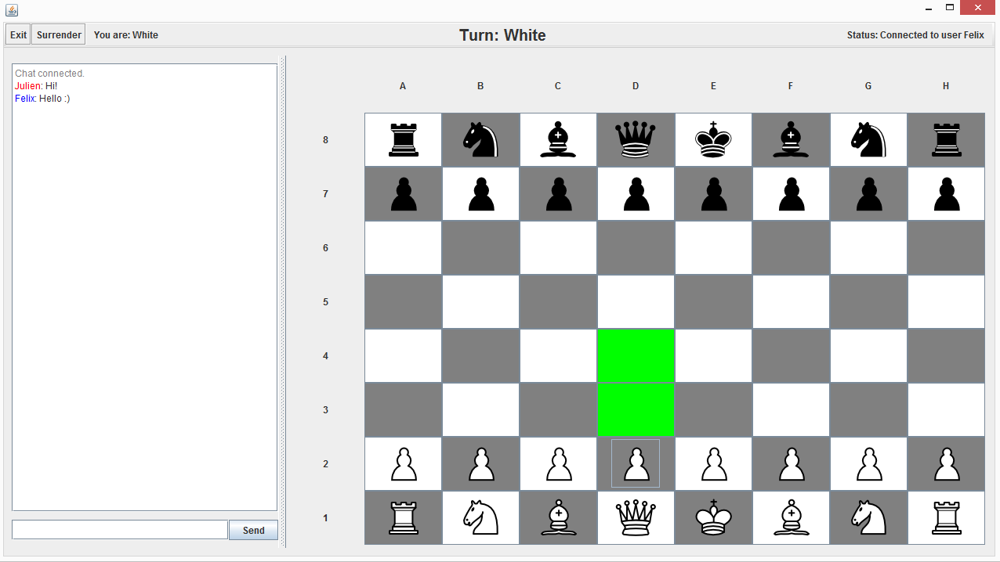
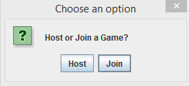

# Simple Chess App

A simple chess app to play with friends.
Features highlighted possible moves and an integrated chat.

## Usage

Press the host button to host a game, and join by entering the ip address of the host. You can play locally by opening multiple instances and joining by entering "127.0.0.1" or localhost or leaving the field empty.
Host port is 8999. Connection status is displayed at the top right of the window.

After hosting/joining, Enter a username under which your messages will be sent.

During your turn, select one of your pieces to highlight the possible moves and click on one to perform the move. You can see who's turn it is in the bar at the window